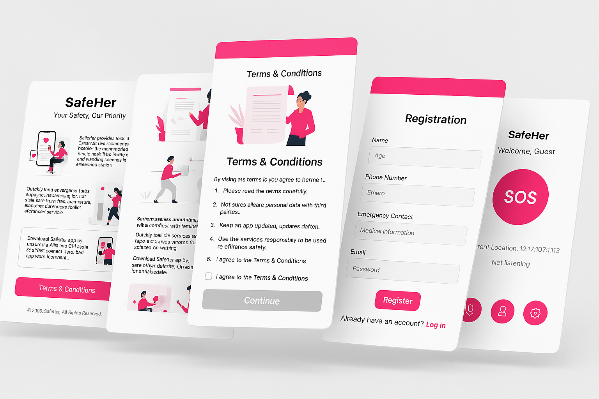

# 🚨 Women Safety Network App

A **community-powered** women safety app that detects emergencies through **voice-recognized codewords** and alerts **nearby users** to assist in real-time.

---



---

## ✨ Features

- 🎙️ **Codeword-Based Emergency Trigger**  
  Detects distress codewords in the background and automatically triggers alerts.

- 📍 **Real-Time Location Sharing**  
  Sends **live location** to emergency contacts and **nearby responders**.

- ⚠️ **Community SOS Alerts**  
  Notifies **registered users** within a configurable radius (500m–1km).

- 🗺️ **Safety Map & Heatmaps**  
  Highlights safe zones and high-risk areas based on real-time community data.

- 🛡️ **AI & Security Suite**  
  Includes **NLP & Sentiment Analysis** to reduce false triggers and **end-to-end encryption** for privacy protection.

---

## 🏗️ Tech Stack

### 📱 Frontend

- **React Native (Expo Go)** – Cross-platform mobile development
- **Tailwind CSS** – Utility-first responsive UI styling
- **React Navigation** – Smooth and intuitive navigation
- **React Native Background Service** – Runs codeword recognition in the background

### 🖥️ Backend

- **Firebase Firestore** – Real-time NoSQL database
- **Firebase Authentication** – Secure user authentication

### 🔗 APIs & Services

- **Twilio API** – Emergency **calls & SMS** notifications
- **Google Maps API** – Live location tracking and rendering safety zones
- **WebSockets** – Enables real-time community alerting
- **Firebase Cloud Messaging (FCM)** – Push notification delivery

### 🧠 AI & Security

- **Voice Recognition** – Recognizes distress codewords in real-time
- **NLP for Emergency Detection** – Avoids false triggers using natural language processing
- **Sentiment Analysis** – Analyzes voice tone for panic detection
- **Predictive Safety Alerts** – AI-driven high-risk area forecasting
- **End-to-End Encryption** – Ensures privacy of chat and location sharing

---

## 🚀 Installation & Setup

### 📦 Prerequisites

Ensure the following are installed on your machine:

- [Node.js (v14+)](https://nodejs.org/en/download/)
- [Git](https://git-scm.com/)
- [Expo CLI](https://docs.expo.dev/get-started/installation/)
- Android or iOS device with the **Expo Go** app from the app store

---

Sure! Here’s the **complete installation section in raw text** that you can copy and paste directly into your `README.md`:

```txt
🚀 Installation & Setup

📥 Step 1: Clone the Repository

```bash
git clone https://github.com/your-username/women-safety-app.git
cd women-safety-app
```

📦 Step 2: Install Dependencies

```bash
npm install
```

🛠️ Step 3: Install Expo CLI Globally (if not already installed)

```bash
npm install -g expo-cli
```

🔐 Step 4: Add Environment Variables

Create a `.env` file in the root of the project and add the following:

```env
GOOGLE_MAPS_API_KEY=your_google_maps_api_key
TWILIO_ACCOUNT_SID=your_twilio_account_sid
TWILIO_AUTH_TOKEN=your_twilio_auth_token
TWILIO_PHONE_NUMBER=your_twilio_phone_number
FIREBASE_API_KEY=your_firebase_api_key
FIREBASE_AUTH_DOMAIN=your_auth_domain
FIREBASE_PROJECT_ID=your_project_id
FIREBASE_STORAGE_BUCKET=your_storage_bucket
FIREBASE_MESSAGING_SENDER_ID=your_sender_id
FIREBASE_APP_ID=your_app_id
```

> 🛡️ **Keep your `.env` file secure. Do not commit it to version control.**

📱 Step 5: Start the Expo Development Server

```bash
npx expo start
```

This will:

- Open **Expo Dev Tools** in your browser  
- Show a **QR code** in the terminal

📲 Step 6: Run on Device

- Download **Expo Go** app from the App Store or Google Play  
- Open **Expo Go** and **scan the QR code** from the terminal/browser  

> 🔁 Changes made to the code will **hot-reload** on your device instantly.

🧪 Optional: Run on Emulator

```bash
npx expo run:android
# or
npx expo run:ios
```

> Make sure your emulator is running **before** executing the command. And both the Devices are Connected to the same Network 
